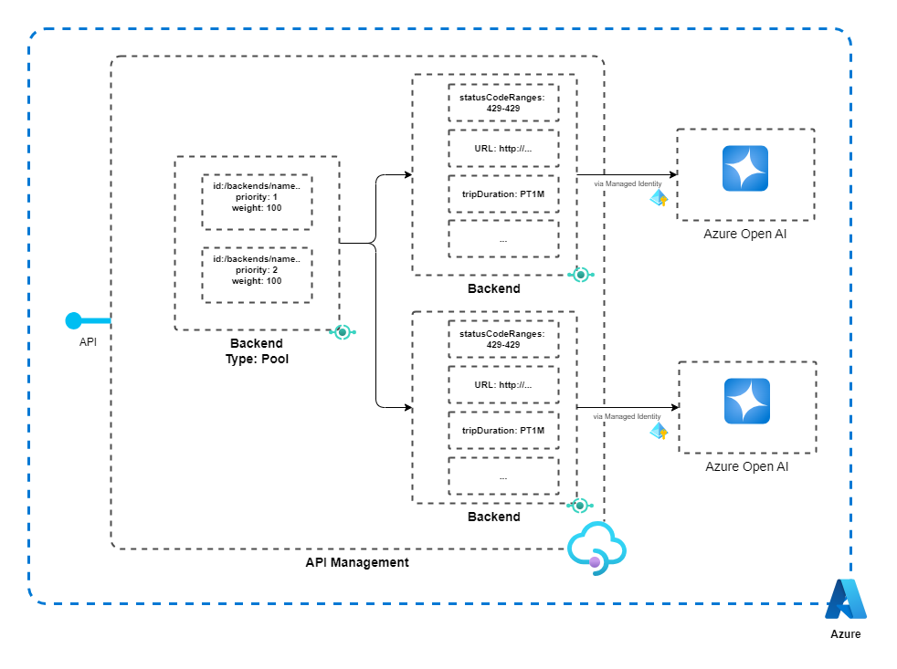

# Quickstart: Create a *Backend Pool* in Azure API Management using Bicep for load balance Open AI requests


[](https://azure.microsoft.com)


## Scenario

This quickstart describes how to use a Bicep file to create a backend pool in Azure API Management instance, for load balance Open AI requests.
It's also use Managed Identity to acess Open AI instances, instead of tradicional access keys.



## Concept

A [backend](https://learn.microsoft.com/en-us/azure/api-management/backends?tabs=bicep) (or *API backend*) in API Management is an HTTP service that implements your front-end API and its operations.

API Management supports *backend pools*, when you want to implement multiple backends for an API and load-balance requests across those backends.

[Bicep](https://learn.microsoft.com/en-us/azure/azure-resource-manager/bicep/overview?tabs=bicep) is a domain-specific language (DSL) that uses declarative syntax to deploy Azure resources. It provides concise syntax, reliable type safety, and support for code reuse. Bicep offers the best authoring experience for your infrastructure-as-code solutions in Azure.

## Prerequisites

- Azure Account with an active subscription. If you don't have an Azure subscription, create a [free account](https://azure.microsoft.com/free/?WT.mc_id=A261C142F) before you begin.

- For Azure CLI:
    - Use the Bash environment in [Azure Cloud Shell](https://learn.microsoft.com/en-us/azure/cloud-shell/overview). For more information, see [Quickstart for Bash in Azure Cloud Shell](https://learn.microsoft.com/en-us/azure/cloud-shell/quickstart).
    - If you prefer to run CLI reference commands locally, [install](https://learn.microsoft.com/en-us/cli/azure/install-azure-cli) the Azure CLI. If you're running on Windows or macOS, consider running Azure CLI in a Docker container. For more information, see [How to run the Azure CLI in a Docker container](https://learn.microsoft.com/en-us/cli/azure/run-azure-cli-docker).
        - If you're using a local installation, sign in to the Azure CLI by using the [az login](https://learn.microsoft.com/en-us/cli/azure/reference-index#az-login) command. To finish the authentication process, follow the steps displayed in your terminal. For other sign-in options, see [Sign in with the Azure CLI](https://learn.microsoft.com/en-us/cli/azure/authenticate-azure-cli).
        - When you're prompted, install the Azure CLI extension on first use. For more information about extensions, see [Use extensions with the Azure CLI](https://learn.microsoft.com/en-us/cli/azure/azure-cli-extensions-overview).
        - Run [az version](https://learn.microsoft.com/en-us/cli/azure/reference-index?#az-version) to find the version and dependent libraries that are installed. To upgrade to the latest version, run [az upgrade](https://learn.microsoft.com/en-us/cli/azure/reference-index?#az-upgrade).
  - For Azure PowerShell:
    - If you choose to use Azure PowerShell locally:
      - [Install the latest version of the Az PowerShell module](https://learn.microsoft.com/en-us/powershell/azure/install-azure-powershell).
      - Connect to your Azure account using the [Connect-AzAccount](https://learn.microsoft.com/en-us/powershell/module/az.accounts/connect-azaccount) cmdlet.
    - If you choose to use Azure Cloud Shell:
      - See [Overview of Azure Cloud Shell](https://learn.microsoft.com/en-us/azure/cloud-shell/overview) for more information.

## Review the Bicep file

The template used in this quickstart is shown below. It deploys an API Management, two Open AI Services, creates the backends for the two endpoints and then creates the backend pool for those two backends.

<!-- :::code language="bicep" source="~/quickstart-templates/quickstarts/microsoft.apimanagement/azure-api-management-create/main.bicep"::: -->

```bicep

var resourceSuffix = uniqueString(subscription().id, resourceGroup().id)
@description('The name of the API Management service instance')
param apiManagementServiceName string = 'apiservice${uniqueString(subscription().id, resourceGroup().id)}'

@description('The pricing tier of this API Management service')
@allowed([
  'Consumption'
  'Developer'
  'Basic'
  'Basicv2'
  'Standard'
  'Standardv2'
  'Premium'
])
param sku string = 'Basicv2'

@description('The instance size of this API Management service.')
@allowed([
  0
  1
  2
])
param skuCount int = 1

@description('Location for all resources.')


param location string = resourceGroup().location
param openAISku string = 'S0'

resource cognitiveServices1 'Microsoft.CognitiveServices/accounts@2021-10-01' = {
  name: 'cog1-${resourceSuffix}'
  location: location
  sku: {
    name: openAISku
  }
  kind: 'OpenAI'  
  properties: {
    apiProperties: {
      statisticsEnabled: false
    }
    customSubDomainName: toLower('cog1-${resourceSuffix}')
  }
}
resource openaidepl1 'Microsoft.CognitiveServices/accounts/deployments@2023-05-01'  =  {
  name: 'openaideploy1'
  parent: cognitiveServices1
  properties: {
    model: {
      format: 'OpenAI'
      name: 'gpt-35-turbo'
      version: '0613'
    }
  }
  sku: {
      name: 'Standard'
      capacity: 10
  }
}

resource cognitiveServices2 'Microsoft.CognitiveServices/accounts@2021-10-01' = {
  name: 'cog2-${resourceSuffix}'
  location: location
  sku: {
    name: openAISku
  }
  kind: 'OpenAI'  
  properties: {
    apiProperties: {
      statisticsEnabled: false
    }
    customSubDomainName: toLower('cog2-${resourceSuffix}')
  }
}
resource openaidepl2 'Microsoft.CognitiveServices/accounts/deployments@2023-05-01'  =  {
  name: 'openaideploy2'
  parent: cognitiveServices2
  properties: {
    model: {
      format: 'OpenAI'
      name: 'gpt-35-turbo'
      version: '0613'
    }
  }
  sku: {
      name: 'Standard'
      capacity: 10
  }
}


resource apiManagementService 'Microsoft.ApiManagement/service@2023-05-01-preview' = {
  name: apiManagementServiceName
  location: location
  sku: {
    name: sku
    capacity: skuCount
  }
  properties: {
    publisherEmail: 'publisher@contoso.com'
    publisherName: 'Contos Publisher'
  }
  identity: {
    type: 'SystemAssigned'
  } 
}


var roleDefinitionID = resourceId('Microsoft.Authorization/roleDefinitions', '5e0bd9bd-7b93-4f28-af87-19fc36ad61bd')
resource roleAssignment1 'Microsoft.Authorization/roleAssignments@2022-04-01' = {
    scope: cognitiveServices1
    name: guid(subscription().id, resourceGroup().id, 'cognitiveServices1')
    properties: {
        roleDefinitionId: roleDefinitionID
        principalId: apiManagementService.identity.principalId
        principalType: 'ServicePrincipal'
    }
}
resource roleAssignment2 'Microsoft.Authorization/roleAssignments@2022-04-01' = {
  scope: cognitiveServices2
  name: guid(subscription().id, resourceGroup().id, 'cognitiveServices2')
  properties: {
      roleDefinitionId: roleDefinitionID
      principalId: apiManagementService.identity.principalId
      principalType: 'ServicePrincipal'
  }
}


resource api 'Microsoft.ApiManagement/service/apis@2023-05-01-preview' = {
  name: 'openai'
  parent: apiManagementService
  properties: {
    apiType: 'http'
    description: 'Azure OpenAI API from API Management'
    displayName: 'OpenAI'
    format: 'openapi-link'
    path: 'openai'
    protocols: [
      'https'
    ]
    subscriptionKeyParameterNames: {
      header: 'api-key'
      query: 'api-key'
    }
    subscriptionRequired: true
    type: 'http'
    value: 'https://raw.githubusercontent.com/Azure/azure-rest-api-specs/main/specification/cognitiveservices/data-plane/AzureOpenAI/inference/stable/2024-02-01/inference.json'
  }
}
resource apiPolicy 'Microsoft.ApiManagement/service/apis/policies@2021-12-01-preview' = {
  name: 'policy'
  parent: api
  properties: {
    format: 'rawxml'
    value: loadTextContent('policy.xml')
  }
}


resource backendOpenAI1 'Microsoft.ApiManagement/service/backends@2023-05-01-preview' = {
  name: 'backend1'
  parent: apiManagementService
  properties: {
    description: 'backend description'
    url: '${cognitiveServices1.properties.endpoint}/openai'
    protocol: 'http'
    circuitBreaker: {
      rules: [
        {
          failureCondition: {
            count: 3
            errorReasons: [
              'Server errors'
            ]
            interval: 'PT5M'
            statusCodeRanges: [
              {
                min: 429
                max: 429
              }
            ]
          }
          name: 'openAIBreakerRule'
          tripDuration: 'PT1M'
        }
      ]
    }    
  }
}
resource backendOpenAI2 'Microsoft.ApiManagement/service/backends@2023-05-01-preview' = {
  name: 'backend2'
  parent: apiManagementService
  properties: {
    description: 'backend description'
    url: '${cognitiveServices2.properties.endpoint}/openai'
    protocol: 'http'
    circuitBreaker: {
      rules: [
        {
          failureCondition: {
            count: 3
            errorReasons: [
              'Server errors'
            ]
            interval: 'PT5M'
            statusCodeRanges: [
              {
                min: 429
                max: 429
              }
            ]
          }
          name: 'openAIBreakerRule'
          tripDuration: 'PT1M'
        }
      ]
    }    
  }
}


resource backendPoolOpenAI 'Microsoft.ApiManagement/service/backends@2023-05-01-preview' = {
  name: 'openai-backend-pool'
  parent: apiManagementService
  properties: {
    description: 'Load balancer for multiple OpenAI endpoints'
    type: 'Pool'
    pool: {
      services: [
        {
          id: '/backends/${backendOpenAI1.name}'
          priority: 1
          weight: 10
        }
        {
          id: '/backends/${backendOpenAI2.name}'
          priority: 1
          weight: 20
        }]
      
    }
  }
}

resource apimSubscription 'Microsoft.ApiManagement/service/subscriptions@2023-05-01-preview' = {
  name: 'openAISubscriptionName'
  parent: apiManagementService
  properties: {
    allowTracing: true
    displayName: 'Open AI Subscription Description'
    scope: '/apis/${api.id}'
    state: 'active'
  }
}

```
Now, review the policy that need to be placed in API Management

```xml
<policies>
    <inbound>
        <base />
        <authentication-managed-identity resource="https://cognitiveservices.azure.com" output-token-variable-name="managed-id-access-token" ignore-error="false" /> 
        <set-header name="Authorization" exists-action="override">  
            <value>@("Bearer " + (string)context.Variables["managed-id-access-token"])</value>  
        </set-header>
        <set-backend-service backend-id="openai-backend-pool" />
    </inbound>
    <backend>
        <base />
    </backend>
    <outbound>
        <base />
    </outbound>
    <on-error>
        <base />
    </on-error>
</policies>

```

<!-- The following resource is defined in the Bicep file:

- **[Microsoft.ApiManagement/service/backends](/azure/templates/microsoft.apimanagement/service/backends)**

More Azure API Management Bicep samples can be found in [Azure Quickstart Templates](https://azure.microsoft.com/resources/templates/?resourceType=Microsoft.Apimanagement&pageNumber=1&sort=Popular). -->

## Deploy the Bicep file

You can use Azure CLI or Azure PowerShell to deploy the Bicep file.  For more information about deploying Bicep files, see [Deploy](../azure-resource-manager/bicep/deploy-cli.md).

1. Save the Bicep file as **main.bicep** to your local computer.
1. In the same folder, save the XML file as **policy.xml** to your local computer
1. Deploy the Bicep file using either Azure CLI or Azure PowerShell.

### CLI

```bash
    az group create --name exampleRG --location eastus

    az deployment group create --resource-group exampleRG --template-file main.bicep
```

### PowerShell

```powershell
    New-AzResourceGroup -Name exampleRG -Location eastus

    New-AzResourceGroupDeployment -ResourceGroupName exampleRG -TemplateFile ./main.bicep
```

---

When the deployment finishes, you should see a message indicating the deployment succeeded.

> It can take between 10 and 30 minutes to create and activate an API Management service. Times vary by tier.

## Review deployed resources

Use the Azure portal, Azure CLI or Azure PowerShell to list the deployed App Configuration resource in the resource group.

### CLI

```bash
az resource list --resource-group exampleRG
```

### PowerShell

```powershell
Get-AzResource -ResourceGroupName exampleRG
```

---

## Clean up resources

When no longer needed, delete the resource group, which deletes the resources in the resource group.

### CLI

```bash
az group delete --name exampleRG
```

### PowerShell

```powershell
Remove-AzResourceGroup -Name exampleRG
```

---

## Related content
* API Management: [API Management documentation](https://learn.microsoft.com/en-us/azure/api-management/)

* API Management Backends: [Backends in API Management](https://learn.microsoft.com/en-us/azure/api-management/backends?tabs=bicep)

* AI Gateway samples: [APIM ❤️ OpenAI - 🧪 Labs for the GenAI Gateway capabilities of Azure API Management](https://github.com/Azure-Samples/AI-Gateway)